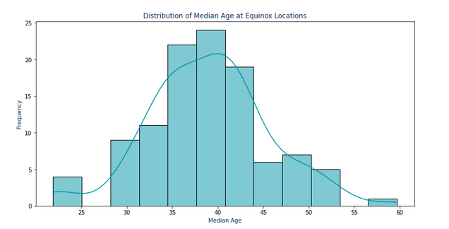

 <head>
    <meta charset="UTF-8">
    <meta name="viewport" content="width=device-width, initial-scale=1.0">
    <link rel="stylesheet" href="css/styles.css">
</head>

<header>
        <h1>EQUINOX Market Analysis</h1>
    </header>
    

        <section class="introduction">
            <h2>Introduction & Objective</h2>
            
The purpose of this analysis is to examine demographic, economic, and housing characteristics of current Equinox club locations. By understanding the patterns that these locations share, we can provide insights that could inform future site selection decisions for Equinox.

            
Despite the absence of internal usage data, this analysis utilizes external data sources to offer a preliminary phase of investigation. The long-term goal is to establish a data-driven approach that could evolve into a predictive model for identifying optimal new locations for Equinox.

        </section>
 <section class="analysis">
            <h2>Descriptive Analysis & Visualizations</h2>
            
We began our analysis by examining the distribution of key demographic variables at Equinox locations and comparing them to state and national averages.

            <h3>1. Median Income of Families by State (Equinox Locations)</h3>
            
The boxplot below illustrates the distribution of median family incomes across different states where Equinox clubs are located. This helps to identify whether Equinox locations are predominantly in wealthier areas compared to the state averages.

            
            <h3>2. Distribution of Median Age at Equinox Locations</h3>
            
The histogram below shows the distribution of median ages at Equinox locations. Understanding the age distribution helps in identifying whether Equinox clubs are more common in areas with younger populations.

            
            <h3>3. Income Distribution: Equinox Locations vs National Average</h3>
            
The following histogram compares the income distribution at Equinox locations to the national average. This comparison is crucial in determining if Equinox clubs are situated in areas with significantly higher income levels than the general population.

            
            <h3>Key Insights</h3>
            

            <ul>
                <li><strong>Located in High Income Areas:</strong> Equinox locations tend to be situated in areas with higher median incomes compared to the national average. This is visually represented by the concentration of locations in higher income brackets and the comparison to the national median.</li>
                <li><strong>Demographic Patterns:</strong> Demographic factors such as age and family income levels show distinct patterns, suggesting that Equinox clubs may thrive in younger, wealthier neighborhoods.</li>
                <li><strong>Correlated Factors:</strong> The correlation heatmap provides a detailed look at how various factors are related to each other and the presence of Equinox locations, laying the groundwork for deeper analysis.</li>
            </ul>
            

        </section>
        <section class="correlation-analysis">
            <h3>Correlation Analysis: Key Factors</h3>
            
We performed a correlation analysis to identify the strongest relationships between demographic and economic factors at Equinox locations. The following insights were derived:

            <ul>
                <li><strong>Household Costs and Family Income:</strong> Strong correlations were observed between household costs (both for renters and homeowners) and family income, indicating that Equinox locations are typically found in wealthier areas.</li>
                <li><strong>Population and Family Size:</strong> The population count is strongly correlated with the number of families and individuals, suggesting that Equinox locations are in denser, family-oriented areas.</li>
                <li><strong>Household Occupancy and Income:</strong> Higher household occupancy rates are associated with higher incomes, further supporting the idea that Equinox locations are in affluent neighborhoods.</li>
            </ul>
        </section>
        <section class="hypothesis-testing">
            <h3>Hypothesis Testing: Median Income</h3>
            
To determine if the median income at Equinox locations is significantly different from the national median income, we conducted a Mann-Whitney U test. This non-parametric test was chosen due to the lack of variance in the national income data, which made a t-test unreliable.

            
<strong>Mann-Whitney U Test Results:</strong>

            <ul>
                <li><strong>U-Statistic:</strong> 99.0</li>
                <li><strong>P-Value:</strong> 0.1547</li>
            </ul>
            
The p-value indicates that there is no statistically significant difference between the median income at Equinox locations and the national median income. This suggests that while Equinox locations are in wealthier areas, the difference is not statistically significant at the 5% level.

        </section>
        <section class="gender-analysis">
            <h3>Gender-Based Income Analysis</h3>
            
We explored the income differences between males and females at Equinox locations compared to the state averages. The following boxplots visualize these differences:

            <h4>1. Male Median Income: Equinox Locations vs. State Averages</h4>
            
            <h4>2. Female Median Income: Equinox Locations vs. State Averages</h4>
            
            <h4>Key Insights</h4>
            <ul>
                <li><strong>Statistically Significant Differences:</strong> Both males and females at Equinox locations have significantly higher median incomes compared to the state averages, as shown by the Mann-Whitney U test results.</li>
                <li>The income levels at Equinox locations underscore the club's presence in affluent areas, with both genders earning more compared to state averages.</li>
            </ul>
            <h4>Hypothesis Testing Results</h4>
            
We conducted Mann-Whitney U tests to assess the significance of the income differences:

            <ul>
                <li><strong>Male Income:</strong> U-Statistic: 661.0, P-Value: \(1.28 \times 10^{-6}\)</li>
                <li><strong>Female Income:</strong> U-Statistic: 696.0, P-Value: \(6.60 \times 10^{-8}\)</li>
            </ul>
            
Both tests confirm that the income differences between Equinox locations and state averages are statistically significant for both males and females.

        </section>
        <section class="conclusion">
            <h2>Conclusion & Future Directions</h2>
            
This analysis provided valuable insights into the demographic and economic characteristics of Equinox locations compared to state and national averages. The key findings are summarized below:

            <h4>1. Income and Demographic Insights</h4>
            <ul>
                <li>Equinox locations are predominantly situated in affluent areas, with median incomes significantly higher than both state and national averages.</li>
                <li>Both male and female income levels at Equinox locations are higher than state averages, and this difference is statistically significant.</li>
                <li>The analysis also revealed correlations between household costs, family income, and population density, further highlighting the wealth and density of areas where Equinox thrives.</li>
            </ul>
            <h4>2. Gender-Based Differences</h4>
            <ul>
                <li>Both males and females at Equinox locations tend to have higher incomes compared to their counterparts at the state level.</li>
                <li>The significant differences in median income between Equinox locations and state averages for both genders underscore the club’s presence in wealthier areas.</li>
            </ul>
            <h4>Future Directions</h4>
            
While this analysis lays a strong foundation for understanding the characteristics of successful Equinox locations, further analysis could focus on predictive modeling to identify potential new locations. Future work could also explore additional factors such as education levels, commuting patterns, and other socioeconomic indicators that might influence the success of a new club location.

            
Overall, this project demonstrates a methodical approach to data analysis, with meaningful insights that can inform strategic business decisions. It showcases the ability to conduct thorough exploratory data analysis, perform hypothesis testing, and effectively communicate findings, making it a valuable contribution to the decision-making process.

        </section>
    

</body>
</html>
